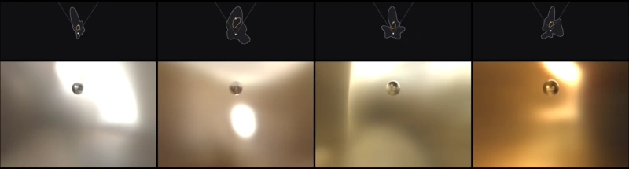

# RoomLight: A 2.5D Illumination Prior for Indoor Environments

A learned prior over HDR panoramas with aligned depth, enabling differentiable optimization of spatially-varying indoor illumination.

[](https://andreead-a.github.io/RoomLight/)
[](https://arxiv.org/pdf/)

[Andreea Ardelean](https://andreead-a.github.io/),
[Bernhard Egger](https://eggerbernhard.ch/)



## 📦 Installation

Dependencies are declared in `pyproject.toml` and resolved with [uv](https://docs.astral.sh/uv/):

```bash
git clone https://github.com/andreead-a/RoomLight.git
cd RoomLight
uv sync                    # training, inverse rendering and evaluation
# uv sync --extra data     # additionally LaMa and MoGe-2, only for src/prepare_training_data.py
```

This creates a `.venv/` environment. Activate it with `source .venv/bin/activate`, or prefix every command below with `uv run`.

## 🤗 Pretrained model

The paper checkpoint is hosted on [Hugging Face](https://huggingface.co/andreead-a/RoomLight/tree/main/checkpoint):

```bash
hf download andreead-a/RoomLight --include "checkpoint/*" --local-dir outputs
```

This places `config.yaml` and `last_epoch.pth` in `outputs/checkpoint/`, which is the path the inverse rendering commands below expect. To train your own model instead, see [Training](#-training).

## 💡 Inverse rendering

We release a synthetic benchmark that isolates the illumination estimate from geometry and material errors, and an optimization script that fits the illumination representation to a single photograph through differentiable rendering with [Mitsuba 3](https://mitsuba.readthedocs.io/).

### Benchmark data

Twenty-five indoor panoramas from [Poly Haven](https://polyhaven.com/hdris/interiors) are lifted to 2.5D area lights and used to illuminate two views of known objects ([bunny and armadillo](https://graphics.stanford.edu/data/3Dscanrep/) in the `input` view, a sphere in the held-out `eval` view), each in three materials: `mirror`, `mattesilver` and `diffuse`. The following downloads the data and rebuilds the derived files used in the optimization:

```bash
python src/setup_benchmark.py data/benchmark
```

`source_dir` in `configs/optim.yaml` points to `data/benchmark/scenes`. Each scene directory holds the panorama and its depth map, a Mitsuba scene `<material>_<view>.xml` with a 2.5D area light emitter, a `<material>_envmap_<view>.xml` variant with an environment map emitter, and the rendered views with the corresponding object masks.

### Fitting

The illumination can be represented either as an environment map or as a 2.5D area light (built from equirectangular radiance and depth), which is optimized directly at the pixel level or parameterized through our prior:

```bash
python src/fit.py prior_al outputs/checkpoint   # 2.5D area light through our prior
python src/fit.py direct_al                     # 2.5D area light direct optimization
python src/fit.py direct_envmap                 # environment map direct optimization
```

All three minimize the same photometric objective on the `input` view. A repulsion penalty keeps the 2.5D area light outside the objects, and the direct modes add a smoothness prior to avoid noisy estimates. Settings live in `configs/optim.yaml` and can be overridden with `-o`, e.g. `-o optim.spp=128`.

Results are written to `<save_dir>/<run name>/<scene>/<material>/`. Use `--scenes` and `--materials` to run a subset, and `--skip-existing` to resume.

### Evaluation

The evaluation script renders the `input` and `eval` views for each case at a high sample count under the fitted illumination, then scores them against the ground truth:

```bash
python src/evaluate.py results/checkpoint results/direct_al results/direct_envmap
```

Three metrics are reported on both views:

* **PSNR**: between the tonemapped render and the benchmark photograph (higher is better).
* **RMSE**: in linear radiance against a linear render of the ground-truth scene (lower is better).
* **RGB angular error**: mean per-pixel angle between predicted and true RGB vectors in degrees (lower is better).

The result on the `input` view shows how well the illumination representation can fit the target observation, while `eval` measures the fitted environment from a new viewpoint that was not used during optimization. `evaluate.py` writes `metrics.json` per case and `summary.json` aggregated over all scenes.

## 🎯 Training

### Training data

The training split is built from the [Laval Indoor HDR dataset](http://hdrdb.com/indoor/#presentation) (2233 panoramas), which has to be requested from its authors. Our preparation script inpaints the nadir hole of each panorama with [LaMa](https://github.com/advimman/lama) and estimates depth with [MoGe-2](https://github.com/microsoft/moge) from overlapping perspective views, producing four-channel (HDR radiance + depth) EXRs at 128×256:

```bash
python src/prepare_training_data.py data/IndoorHDRDataset2018 data/panoramas/train
```

Prepare a validation split the same way into `data/panoramas/val`, either held out from Laval or from another source such as [Poly Haven](https://polyhaven.com/hdris/interiors). For fast loading, pack both splits into tensor caches:

```bash
python src/build_cache.py data/panoramas data/panoramas_cache
```

### Training the prior

`configs/train.yaml` holds the paper configuration: 300 epochs at batch size 32, about 2 hours on an RTX A5000. Config entries can be overridden on the command line:

```bash
python src/train.py --config configs/train.yaml data_root=data/panoramas_cache output_dir=outputs/run_default
```

Losses and image panels are logged to [wandb](https://wandb.ai) (set `WANDB_MODE=offline` to log locally). The output directory can be passed directly to `src/fit.py prior_al`.

## 🎓 Citation

Should you find our work useful in your research, please cite:


```bibtex
@article{ardelean2026roomlight,
  title   = {RoomLight: A 2.5D Illumination Prior for Indoor Environments},
  author  = {Ardelean, Andreea and Egger, Bernhard},
  journal = {arXiv preprint arXiv:2609.28300},
  year    = {2026}
}
```

## 🙌 Acknowledgements

This work relies on [Mitsuba 3](https://github.com/mitsuba-renderer/mitsuba3), [MoGe](https://github.com/microsoft/MoGe) and [LaMa](https://github.com/advimman/lama), and on the [Laval Indoor HDR](http://hdrdb.com/indoor/) and [Poly Haven](https://polyhaven.com/) datasets. Thanks to all the authors for sharing their work!

## 📝 License

The code is released under the CC BY 4.0 [LICENSE](LICENSE).
The benchmark data is on [Hugging Face](https://huggingface.co/andreead-a/RoomLight) under CC BY-NC 4.0, as it uses non-commercial [Stanford 3D Scanning Repository](https://graphics.stanford.edu/data/3Dscanrep/) meshes.
